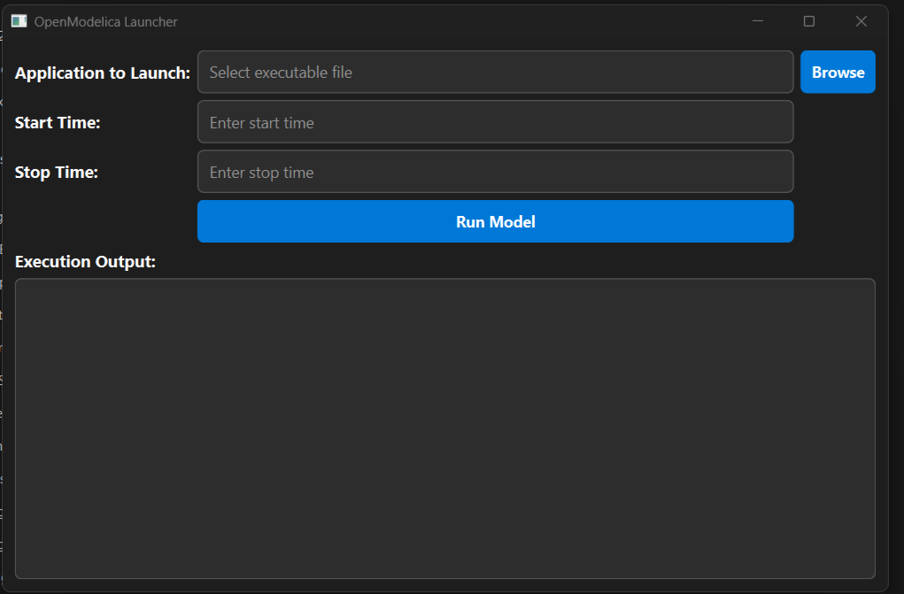
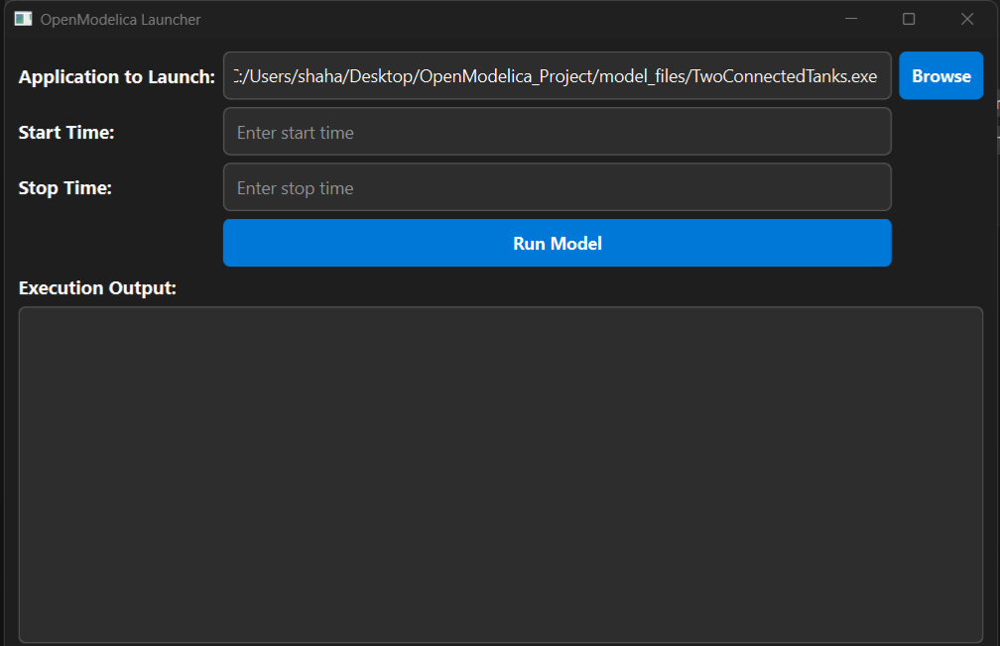
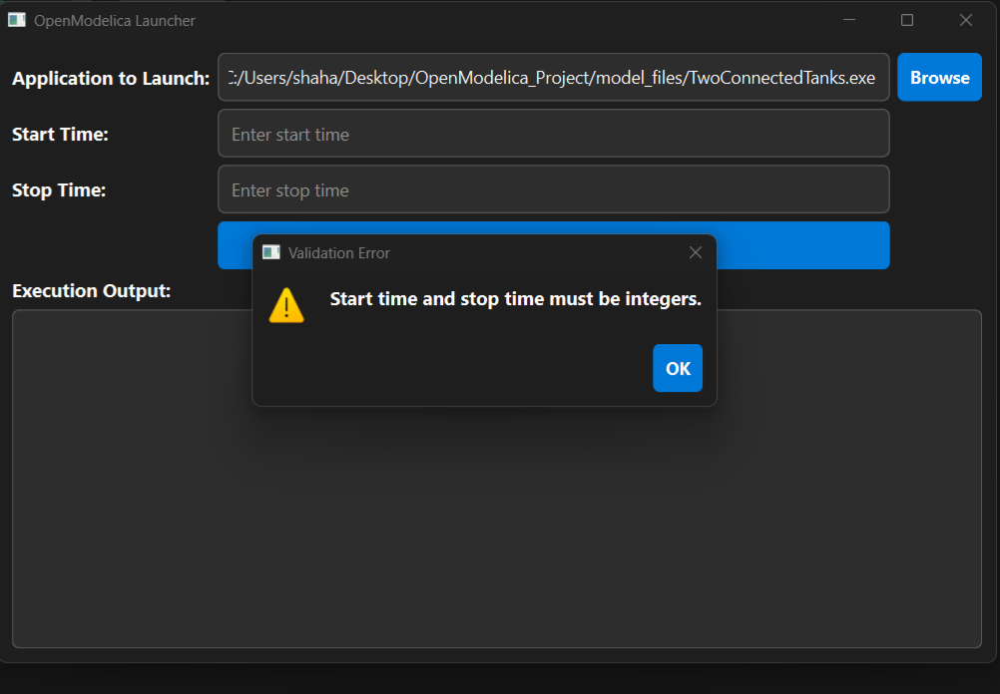
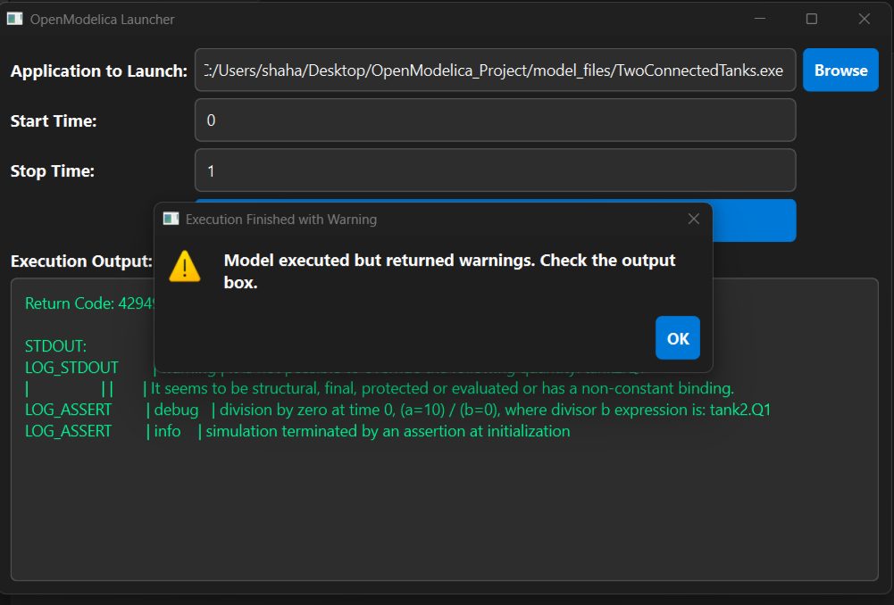

# OpenModelica Launcher App

## Objective
This project is a PyQt6 desktop application used to launch an OpenModelica executable with user-defined start time and stop time.

This project is a PyQt6 desktop application used to launch an OpenModelica executable with user-defined start time and stop time.

The application allows users to browse and select the compiled OpenModelica model executable, enter simulation start and stop times, validate the inputs, and run the model directly from the GUI.

Direct executable available in the `launcher_exe` folder.

## Technologies Used
- Python 3
- PyQt6
- OpenModelica
- Windows 10/11

## Features
- Select executable file
- Enter start time
- Enter stop time
- Validate inputs
- Execute OpenModelica model

## Validation Condition
0 <= start time < stop time < 5

## How to Run
1. Install requirements:
   pip install -r requirements.txt

2. Open terminal in app folder:
   python main.py

## Folder Structure
- app/main.py
- model_files/
- requirements.txt
- README.md
- ## Screenshots

## Screenshots

### Main UI

### Browse File

### Validation Error

### Execution Output

## Known Issues
- The OpenModelica model may show division-by-zero warnings depending on model parameters.
- Some OpenModelica runtime DLL files may be required locally for the executable to run.

## Future Improvements
- Add dark/light mode toggle
- Add drag-and-drop support for executable files
- Add execution history
- Add graphical display of simulation results
- Add support for multiple OpenModelica models
  
## Run Directly Using Executable

If you do not want to run the Python code manually, you can use the executable version:

1. Open the `launcher_exe` folder
2. Download `main.exe`
3. Double-click `main.exe` to launch the application
   
